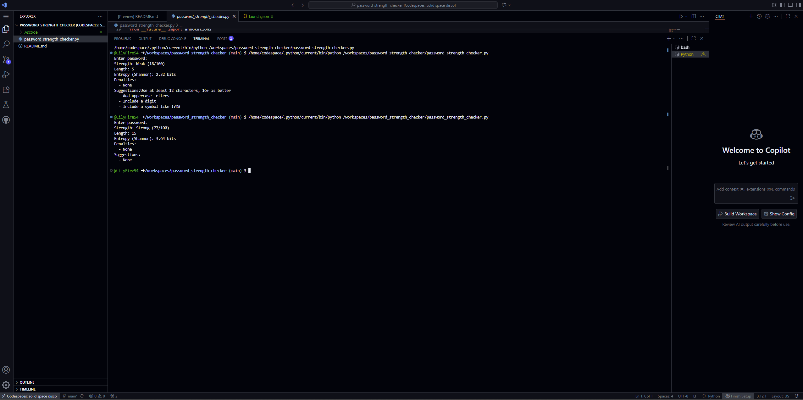

# 🔑 Password Strength Checker (Python)

A lightweight Python tool that evaluates password strength and gives suggestions to improve it.  
The script scores passwords from **0–100** and labels them as **Weak, Fair, Good, or Strong** (with colors in the terminal).

---

## 🚀 Features
- ✅ Color-coded strength labels (Weak = red, Fair = yellow, Good = cyan, Strong = green)  
- ✅ Detects common patterns (dictionary words, repeats, sequences)  
- ✅ Gives actionable suggestions to improve passwords  
- ✅ No external dependencies — pure Python standard library  

---

## 📸 Example Output
  
*Example: evaluating a password in VS Code terminal.*

---

## ⚙️ Usage

### Run with a single password:
```bash
python password_strength_checker.py "MyS3cret!"
